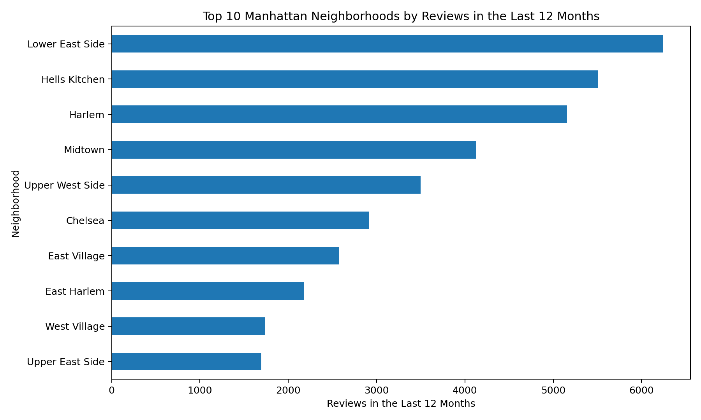
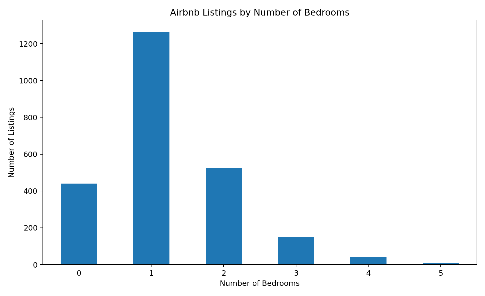
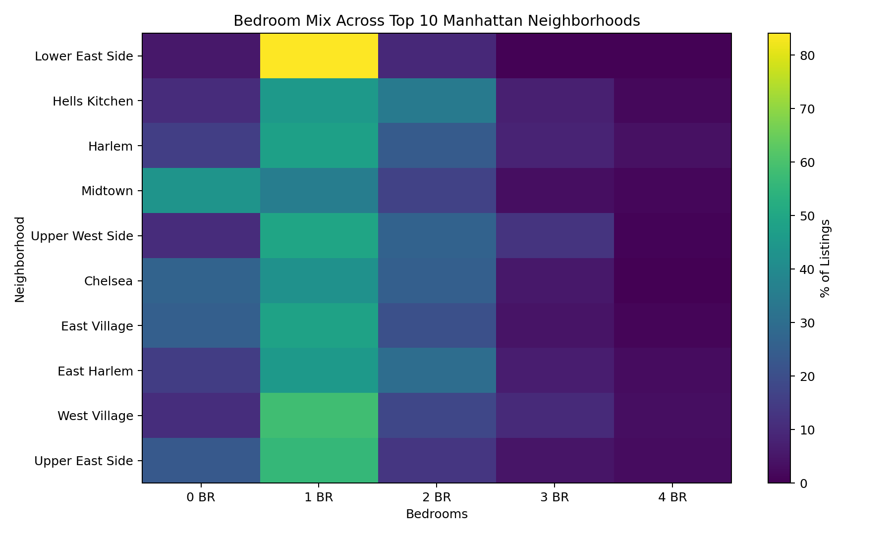
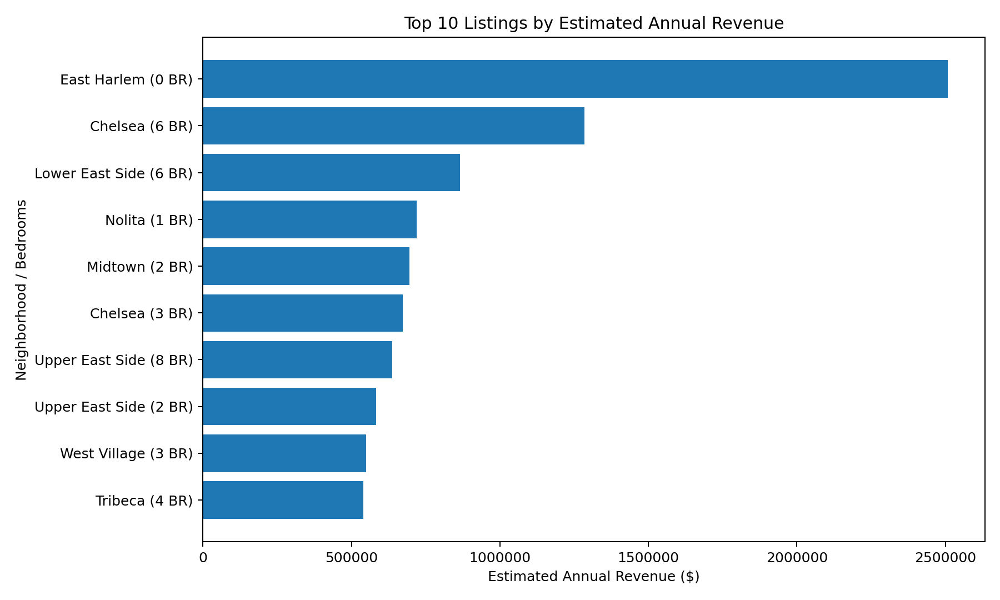

# Airbnb Manhattan Vacation Rental Market Analysis

## Project Overview

This project analyzes Airbnb listing and calendar data to identify attractive vacation-rental opportunities in Manhattan.

The analysis focuses on rental demand, bedroom preferences, neighborhood performance, and estimated revenue to support data-driven investment decisions.

## Business Objective

The goal is to help a potential Airbnb investor identify:

- High-demand Manhattan neighborhoods
- Popular property sizes
- Neighborhood-specific bedroom preferences
- Listings with strong estimated revenue potential
- Potential investment opportunities based on demand and revenue

## Tools & Skills

- Microsoft Excel
- Pivot Tables
- Data Analysis
- Data Cleaning
- Revenue Analysis
- Market Segmentation
- Business Intelligence
- Data-Driven Recommendations

## Analysis Performed

### 1. Neighborhood Demand
Identified the top Manhattan neighborhoods based on reviews received during the previous 12 months as an indicator of rental demand.

### 2. Bedroom Analysis
Analyzed bedroom counts to determine which property sizes were most popular.

### 3. Neighborhood & Bedroom Demand
Compared neighborhood demand with bedroom preferences to identify combinations of location and property size with stronger demand.

### 4. Revenue Analysis
Used calendar pricing and availability information to estimate annual revenue and identify listings with attractive revenue potential.

## Visualizations

### Top 10 Neighborhoods


### Bedroom Mix


### Neighborhood & Bedroom Mix


### Estimated Annual Revenue


## Key Findings

- The analysis identified the highest-demand Manhattan neighborhoods using recent review activity.
- One-bedroom properties were generally the most popular property size across high-demand neighborhoods.
- Midtown showed stronger demand for studio apartments relative to one-bedroom properties.
- Combining neighborhood demand with property-size preferences provides a stronger investment signal than evaluating either factor alone.

## Business Recommendations

1. Focus investment research on the highest-demand Manhattan neighborhoods.
2. Prioritize one-bedroom properties where that property size has strong demand.
3. Consider studio apartments in Midtown because of their stronger relative demand.
4. Evaluate location and property size together when comparing investment opportunities.
5. Use estimated revenue alongside demand indicators before making an investment decision.

## Project Files

```text
airbnb-manhattan-market-analysis/
├── README.md
├── analysis/
│   └── Airbnb_Manhattan_Market_Analysis.xlsx
├── data/
│   └── README.md
└── visualizations/
    └── README.md
```

## Skills Demonstrated

**Business Analytics:** Market analysis, demand analysis, revenue analysis, business recommendations

**Technical:** Excel, Pivot Tables, data cleaning, data analysis

**Analytical:** Segmentation, KPI analysis, pattern identification, strategic decision-making

## Project Outcome

This project demonstrates how raw business data can be transformed into actionable insights for a potential real-estate investment decision.

## Author

**Tracy Crespo**

Aspiring Business Analyst | Business Analytics | SQL | Power BI | Tableau
